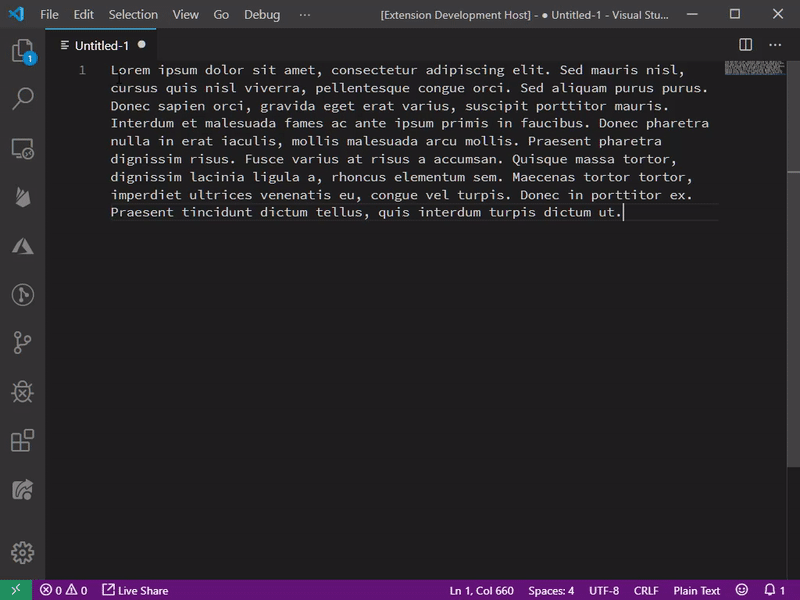

# Toggle Capitalisation
Toggle Caps allows you to change the case of the selected text from `UPPER CASE` -> `Title Case` -> `lower case` with the press of your keyboard. Default shortcut is `CTRL+.` on Windows (`CMD+.` on Mac). Also accessible via the command palette (`CTRL+SHIFT+P`) under "Toggle Capitalisation".

Download from the [Releases](https://github.com/ClockworkSquirrel/vscode-toggle-caps/releases) tab, and install via the "Install VSIX" command in VSCode.

# Release Notes
## 0.0.1

Initial release of Toggle Capitalisation extension.
